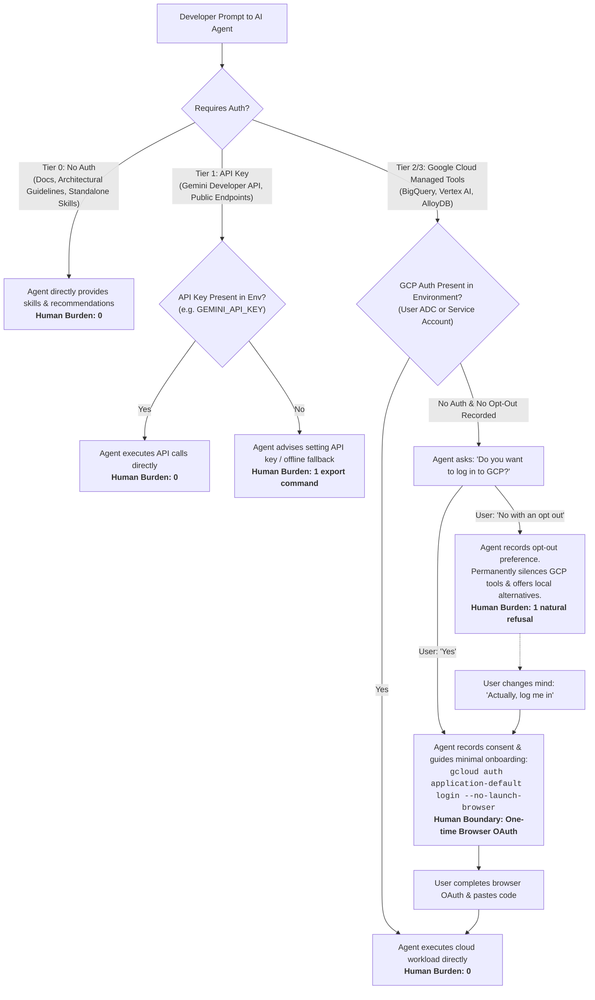

# Agent Resource Discovery (ARD v0.5) • Google Ecosystem Exploration

[](https://zeroasterisk.github.io/ard-plugin-exploration/)
[](https://agenticresourcediscovery.org)
[](./tests/e2e_podman_runner.py)

Autonomous AI coding agent exploration (**OpenCode**) discovering and using **Google Cloud Managed MCP Servers** and **Google Agent Skills** via a canonical ARD v0.5 manifest (`ai-catalog.json`).

---

## 🎯 The Complete Real-World Developer Journeys

| Journey | Developer Action | Agent & ARD Behavior | Human Burden |
| :--- | :--- | :--- | :--- |
| **1. Zero-Auth Discovery (Tier 0)** | *"I need SQL tuning & zero-trust security best practices"* | Recommends Tier 0 skills (`bigquery-guidelines`, `cloud-security-foundations`). | **0 commands, 0 auth friction** |
| **2. Respectful Opt-Out** | *"No with an opt out"* when asked to log in | Persistently stores `opt_out`. Silences all GCP tools and prompts. Recommends local alternatives. | **1 natural refusal** |
| **3. Live Human OAuth Onboarding & Execution** | 1. *"Yes, please log me in"*<br/>2. Completes browser OAuth login | Detects active ADC (`auth_ready: true`). Immediately runs SQL query against BigQuery API & summarizes data. | **Only browser OAuth consent** |
| **4. API Key Only (Tier 1)** | Launches container with `GEMINI_API_KEY` | Unlocks Tier 1 Gemini developer tools directly without GCP account or login. | **0 GCP logins** |
| **5. Enterprise Service Account (Tier 3)** | Mounts `GOOGLE_APPLICATION_CREDENTIALS` | Passively detects service account on boot. Enables all cloud tools without prompts. | **0 prompts** |
| **6. Changing Mind (Opt-Out $\rightarrow$ Opt-In)** | *"Actually, I changed my mind. Please log me in"* | Updates preference to `allowed`, re-enables cloud discovery, and provides login commands. | **Seamless transition** |

---

### 🧭 Autonomous Agent Decision & Progressive Auth Flowchart



---

## 🎥 Watch the Real OpenCode Agent Execution

🔗 **Live Web Player:** **[https://zeroasterisk.github.io/ard-plugin-exploration/](https://zeroasterisk.github.io/ard-plugin-exploration/)**

```bash
# Play locally via asciinema:
asciinema play demo.cast

# Or open in browser:
google-chrome index.html
```

---

## 🌐 Open ARD Ecosystem & Interoperability

This catalog complies with the **[Agent Resource Discovery (ARD v0.5)](https://agenticresourcediscovery.org)** open specification (`urn:ai:google.com:...`). It is compatible with all ARD implementations:

- **Our OpenCode / Antigravity MCP Plugin** (`src/ard_mcp_server.py` & `opencode.json`)
- **[Mindpower Agent Finder](https://mindpower.github.io/agent-finder/)** (Client-side directory indexing)
- **[Hugging Face Discover (`hf-discover`) & EvalState](https://evalstate-hf-agentfinder.hf.space/docs#/)**
- Any client discovering `/.well-known/ai-catalog.json` (see [ARD Reference Implementations](https://agenticresourcediscovery.org/ref_implementations/)).

---

## 🧪 Automated Testing

```bash
# Run real OpenCode AI agent E2E test runner in Podman container:
python3 tests/e2e_podman_runner.py

# Run unit and multi-turn conversational scenario suite:
python3 -m unittest discover -s tests -v
```

---

## 📁 Repository Layout

```text
ard-plugin-exploration/
├── ai-catalog.json                # Canonical ARD v0.5 catalog (27+ tools/skills)
├── opencode.json                  # OpenCode MCP integration config
├── Dockerfile                     # OpenCode container based on ghcr.io/anomalyco/opencode
├── demo.cast                      # Genuine live OpenCode AI agent PTY recording
├── index.html                     # Interactive web player for GitHub Pages
├── scripts/
│   ├── banner.sh                  # Fast scenario header rendering shortcuts
│   └── record_opencode_real_session.py # Real PTY recorder driving OpenCode binary
├── src/
│   ├── ard_resolver.py            # Zero-dependency Python search & auth engine
│   └── ard_mcp_server.py          # JSON-RPC stdio MCP server for OpenCode
└── tests/
    ├── test_ard_resolver.py       # Unit tests (auth scenarios & URN validation)
    ├── test_opencode_scenarios.py # Multi-turn conversational flow tests
    └── e2e_podman_runner.py       # Real OpenCode agent E2E test runner
```
